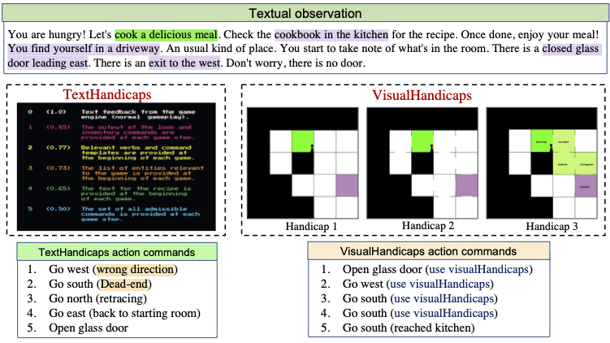
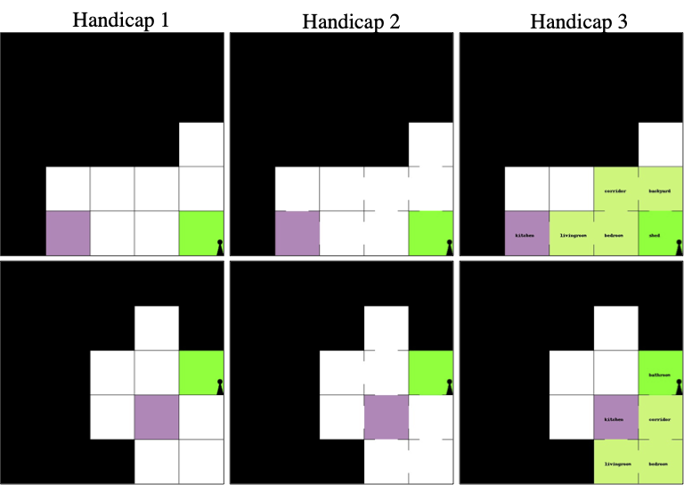

# VisualHints
Repository for VISUALHANDICAPS: Systematic Handicaps for Text-based Games. We provide `VisualHandicaps` environment with various options for customizing the details available in the mental maps to emulate various difficulty levels of the handicaps.




We present VISUALHANDICAPS, a new environment for systematic analysis of text-based games (TBGs) to improve the performance of reinforcement learning
(RL) agents by providing visual handicaps or hints related to the game instances. Taking inspiration from the biological learning process that leverages mental maps of the (game) world for robust planning, we seek to analyze the performance of RL agents on TBGs when such systematic mental maps of varying difficulties are provided as handicaps. Previous works designed handicaps that allow additional textual information to simply measure how effectively an RL agent can understand from sequential natural language information with varying amounts of details. In contrast, our VISUALHANDICAPS environment seeks to improve the generalization ability of the RL agents using varying details of maps along with textual information - a setting that is inspired by learning in animals akin to real-world RL. 

## Dependencies installation
It is recommended to use a Anaconda + virtual environment. We assume CUDA10 (found in `/usr/loca/cuda`) is installed.<br /> 
Please change the command according to your CUDA version, which can be found at `https://pytorch.org/`.
```bash
pip install gym 
pip install tqdm pillow matplotlib
pip install textworld==1.3.2
conda install pytorch torchvision cudatoolkit=10.0 -c pytorch
```

## Format for using the generic VisuaHints environment

The following code snippet shows basic usage of the VisualHints environment.

```
from tw_cooking_game_puzzle.visual_hints import VisualHints
env = VisualHints(path, request_infos, batch_size, asynchronous, distance_of_puzzle, add_death_room, 
                  clue_first_room, max_number_inaccessible_rooms, room_name, color_way, upgradable_color_way,
                  name_type, draw_passages, draw_player, level_clue, random_place, name)
```

The meaning of the input options are as follows:
```
- <path>                : Path to environment Textworld file.
- <request_infos>       : Additional infos requested from the game.
- <distance_of_puzzle>  : Distance of hint from the kitchen (final room).
- <add_death_room>      : Whether to add death room (agent dies in death room).
- <clue_first_room>     : Whether the visual hints can be found in the first room.
- <room_name>           : Should room name be displayed in the visual hints.
- <color_way>           : Should the way to the kitchen be highlighted.
- <name_type>           : Whether to use roomnames or number for room title.
- <draw_passages>       : Whether to show open passage between rooms.
- <draw_player>         : Should the current position of the player be drawn.
```

## How to generate cooking games of different difficulties:
Here, the goal of the agent is to reach the kitchen room, where the agent has to prepare the meal and eat the meal to win the game.

- We use the TextWorld Cooking as base environments. Please download the games from https://aka.ms/ftwp and put the files in the `env_files` folder.

- Next obtain the navigational games, and pass them as the input games to environment. 
```
root_dir = os.path.expanduser("~/Data/text_world_compete/ftwp/games/")
allowed_actions = __ALL_ACTIONS
train_files, navigation_train_files, non_navigation_train_files = get_nav_non_nav_files(root_dir=root_dir,allowed_actions=allowed_actions, 
                                                                                        kind='train')
games_go6, games_go9, games_go12 = split_navigation_games(navigation_train_files)
env = CookingNavigationEnv(game_list, im_size=500, num_actions=5, stack_dim=None, time_penalty=False, hint_level=3)
```



## Demo
Please see `visualHints_demo.py` for a demonstration of a game along with VisualHandicaps. We use the TextWorld Cooking as base environments. Please download the games from https://aka.ms/ftwp and put the files in the `env_files` folder.
