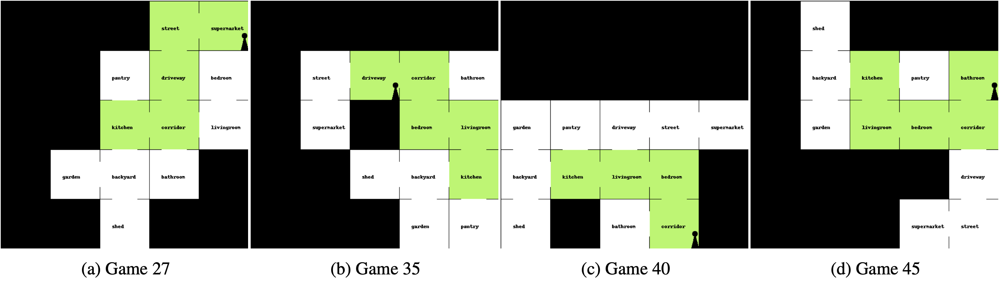
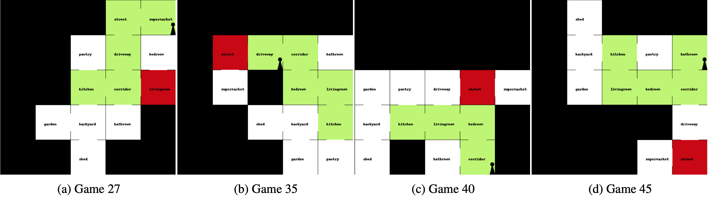
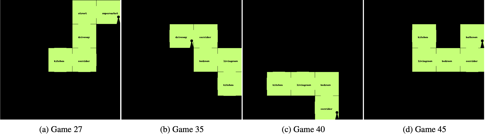
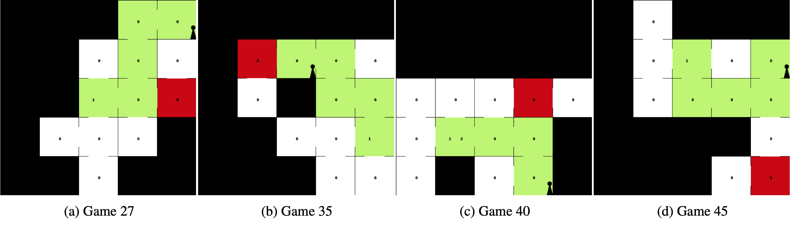
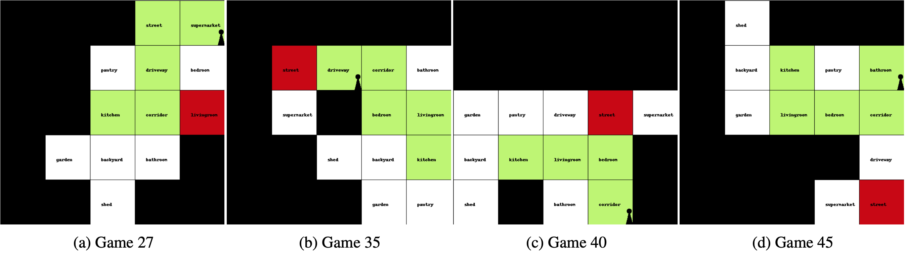
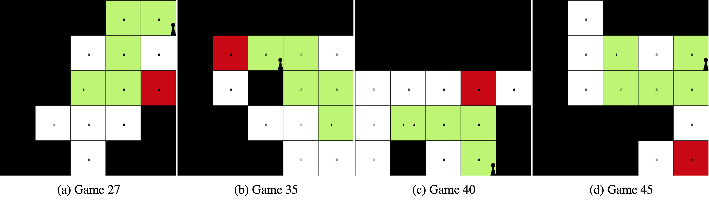

# VisualHints
Repository for VisualHints: A Visual-Lingual Environment for Multimodal Reinforcement Learning. We provide `VisualHints` environment with various options for customizing the type of visual hints to emulate various real-world scenarios.

```
@inproceedings{carta-etal-2020-vizhints,
    title = "Q-learning with Language Model for Edit-based Unsupervised Summarization",
    author = "Carta, Thomas and Chaudhury, Subhajit and Talamadupula, Kartik and Tatsubori, Michiaki",
    booktitle = "arxiv",
    year = "2020"
}
```

## Dependencies installation
It is recommended to use a Anaconda + virtual environment. We assume CUDA10 (found in `/usr/loca/cuda`) is installed.<br /> 
Please change the command according to your CUDA version, which can be found at `https://pytorch.org/`.
```bash
pip install gym 
pip install tqdm pillow
pip install textworld==1.3.2
conda install pytorch torchvision cudatoolkit=10.0 -c pytorch
```

## Format for using the VisuaHints environment

The following code snippet shows basic usage of the VisualHints environment.

```
from tw_cooking_game_puzzle.visual_hints import VisualHints
env = VisualHints(path, request_infos, batch_size, asynchronous, distance_of_puzzle, add_death_room, 
                  clue_first_room, max_number_inaccessible_rooms, room_name, color_way, upgradable_color_way,
                  name_type, draw_passages, draw_player, level_clue, random_place, name)
```

The meaning of the input options are as follows:
```
python -m textrl.generator.gym_textworld.scripts.tw-make twcc_<type>_level<level>_gamesize<numgames>_step<step>_seed3_<mode>
- <path>                : Path to environment Textworld file.
- <request_infos>       : Additional infos requested from the game.
- <distance_of_puzzle>  : Distance of hint from the kitchen (final room).
- <add_death_room>      : Whether to add death room (agent dies in death room).
- <clue_first_room>     : Whether the visual hints can be found in the first room.
- <room_name>           : Should room name be displayed in the visual hints.
- <color_way>           : Should the way to the kitchen be highlighted.
- <name_type>           : Whether to use roomnames or number for room title.
- <draw_passages>       : Whether to show open passage between rooms.
- <draw_player>         : Should the current position of the player be drawn.
```

## How to generate games:
**Mode 1**: The goal of the agent is to reach the kitchen room, where the agent has to prepare the meal and eat the meal to win the game.
```
env = VisualHints(path=path, request_infos=request_infos, batch_size=1, asynchronous=True, mask=False, 
                  distance_of_puzzle=4, add_death_room=False, clue_first_room=True, max_number_inaccessible_rooms=2, 
                  room_name=True, color_way=True, upgradable_color_way=True, name_type='literal', draw_passages=True, 
                  draw_player=True, level_clue='easy', random_place=True, name='cooking_game')
```


**Mode 2**: Adding death room to VisualHints to emulate the role of safety in the real world. The modified goal of the agent is to reach the kitchen room while avoiding going to the death-room. The agent dies and the game is over if the agent visits the death-room.
```
env = VisualHints(path=path, request_infos=request_infos, batch_size=1, asynchronous=True, 
                  mask=False, distance_of_puzzle=4, add_death_room=True, clue_first_room=True,
                  max_number_inaccessible_rooms=2, room_name=True, color_way=True, upgradable_color_way=True,
                  name_type='literal', draw_passages=True, draw_player=True, level_clue='easy', random_place=True, name='cooking_game')
```


**Mode 3**: Masked configuration of the game where only the pathway to the kitchen is highlighted and other details are masked. This will make it easier for the agent to reach the target which is the kitchen in this case. However, even the death room is masked and hence it is dangerous for the agent to deviate from the shown green pathway.
```
env = VisualHints(path=path, request_infos=request_infos, batch_size=1, asynchronous=True, 
                  mask=False, distance_of_puzzle=4, add_death_room=True, clue_first_room=True,
                  max_number_inaccessible_rooms=2, room_name=True, color_way=True, upgradable_color_way=True,
                  name_type='literal', draw_passages=True, draw_player=True, level_clue='easy', random_place=False, name='cooking_game')
```



**Mode 4**: Name of the room is masked and only the room importance is displayed. For the primary target~(kitchen) the room importance is kept at 1 and for secondary targets (like rooms where the ingredients need to be picked from) are shown with importance of 2. All other rooms are shown with importance of 0.
```
env = VisualHints(path=path, request_infos=request_infos, batch_size=1, asynchronous=True, 
                  mask=False, distance_of_puzzle=4, add_death_room=True, clue_first_room=True,
                  max_number_inaccessible_rooms=2, room_name=True, color_way=True, upgradable_color_way=True,
                  name_type='room_importance', draw_passages=True, draw_player=True, level_clue='easy', random_place=False, name='cooking_game')
```


**Mode 5**: The pathways between each room are masked and the agent cannot have a notion of which direction is available for travel only from the visual hint. In such a case, the multi-modal agent has to rely on the textual observation to ascertain which direction has an open door and thus decide to take action accordingly.
```
env = VisualHints(path=path, request_infos=request_infos, batch_size=1, asynchronous=True, 
                  mask=False, distance_of_puzzle=4, add_death_room=True, clue_first_room=True,
                  max_number_inaccessible_rooms=2, room_name=True, color_way=True, upgradable_color_way=True,
                  name_type='room_importance', draw_passages=False, draw_player=True, level_clue='easy', random_place=False, name='cooking_game')
```


**Mode 6**: Combines the previous two modes where the pathways between each room are masked in addition to the roomnames being replaced with room importance.
```
env = VisualHints(path=path, request_infos=request_infos, batch_size=1, asynchronous=True, 
                  mask=False, distance_of_puzzle=4, add_death_room=True, clue_first_room=True,
                  max_number_inaccessible_rooms=2, room_name=True, color_way=False, upgradable_color_way=True,
                  name_type='literal', draw_passages=False, draw_player=True, level_clue='easy', random_place=False, name='cooking_game')
```



## Demo
Please see `visualHints_demo.ipynb` for a demonstration of a game along with VisualHints. We use the TextWorld Cooking as base environments. Please download the games from https://aka.ms/ftwp and put the files in the `env_files` folder.
